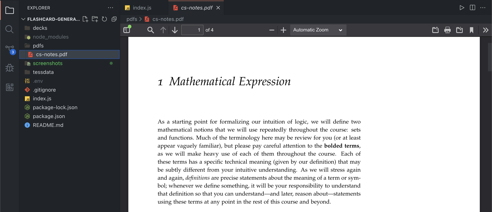
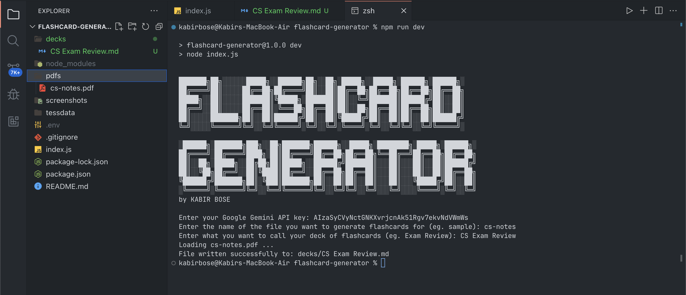
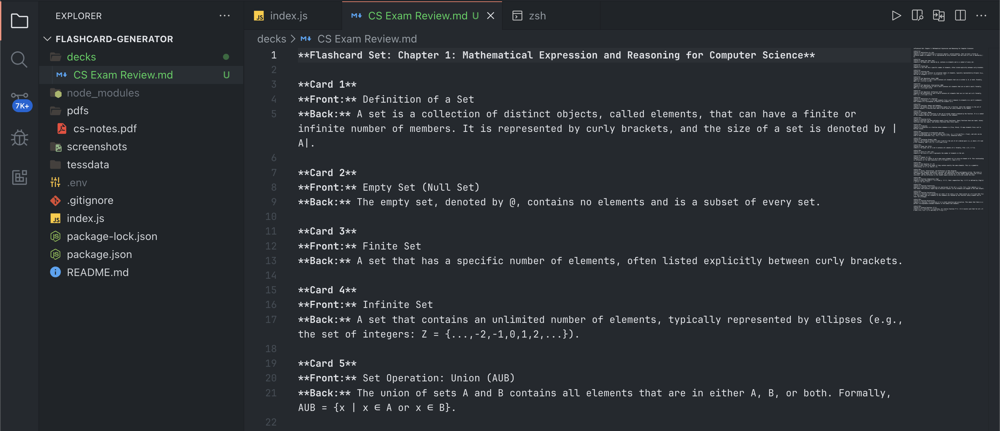
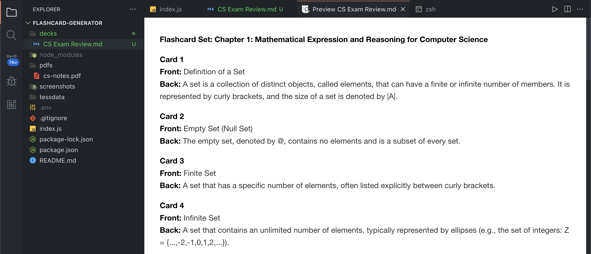

# AI-Powered Flashcard Generator

A fast, terminal application that leverages Google's Gemini AI to generate flashcards/study notes with ease. It takes a PDF file as input, uses OCR to extract the text out of the PDF file, and uses detailed prompts to generate useful flashcards.

# Setup

There are a couple things you need before using this program.

1. Node.js --> [Download it here!](https://nodejs.org/en/download)
2. Google Gemini API key --> [Get one here!](https://ai.google.dev/gemini-api/docs/api-key)
3. GhostScript (You can install it locally or globally) --> [download it here](https://ghostscript.com/releases/gpdldnld.html) or [here for Mac!](https://discussions.apple.com/thread/8584571?sortBy=best)
4. Optional: Text Editor (I recommend Visual Studio Code) --> [Download it here!](https://code.visualstudio.com/download)

# Usage

1. Clone the repository --> `git clone https://github.com/KabirBose/Flashcard-Generator`
2. Enter the directory with your terminal --> `cd /YOUR/PATH/TO/flashcard-generator`
3. Install all the dependencies --> `npm i` or `npm install`
4. Add PDF files that you want to convert into flashcards into the `pdfs` folder
5. Run the program --> `npm run dev`

# Screenshots
Here is an example of the input (a PDF file):

The program in process:

The output file (in Markdown language):

Preview of the output file:

# Credits

Thank you to the developers of Tesseract, GhostScript, Google Gemini, and Node-PDF-OCR.
